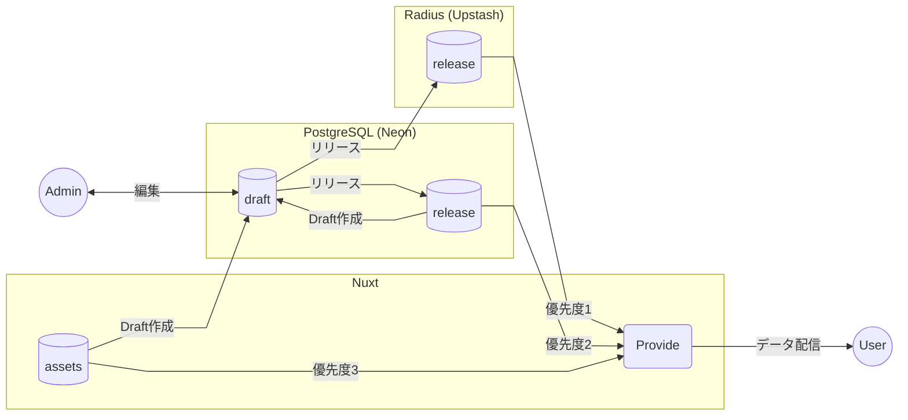
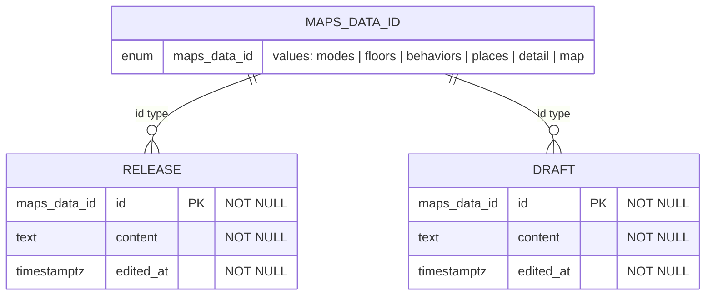

# バックエンドの仕様

## オンライン簡易編集機能

- あくまでも簡易的な編集を提供する
  - 高度なものはSVGエディタの実装が必要になるため、対象外
- バージョン管理は行わない
- 編集中の"draft"と公開中の"release"の2種類のデータを管理する

## 構成図

```mermaid
%%{ init: { "flowchart": { "curve": "linear", "nodeSpacing": 40, "rankSpacing": 80 } } }%%
flowchart LR

%% セクション
subgraph Nuxt
  direction TB
  N_assets[(assets)]
  N_provider(Provide)
end

subgraph DB["PostgreSQL (Neon)"]
  direction TB
  D_draft[(draft)]
  D_release[(release)]
end

subgraph Radius["Radius (Upstash)"]
  direction TB
  R_release[(release)]
end

%% 外部
U((User))
A((Admin))

%% フロー
N_assets --Draft作成--> D_draft
D_release --Draft作成--> D_draft 
D_draft --リリース--> D_release
D_draft --リリース--> R_release

R_release --優先度1--> N_provider
D_release --優先度2--> N_provider
N_assets --優先度3--> N_provider
N_provider --データ配信--> U

A <--編集--> D_draft
```

## データベース ER図

```mermaid
erDiagram
    MAPS_DATA_ID {
        enum maps_data_id "values: modes | floors | behaviors | places | detail | map"
    }

    RELEASE {
        maps_data_id id PK "NOT NULL"
        text content "NOT NULL"
        timestamptz edited_at "NOT NULL"
    }

    DRAFT {
        maps_data_id id PK "NOT NULL"
        text content "NOT NULL"
        timestamptz edited_at "NOT NULL"
    }

    MAPS_DATA_ID ||--o{ RELEASE : "id type"
    MAPS_DATA_ID ||--o{ DRAFT   : "id type"
```
