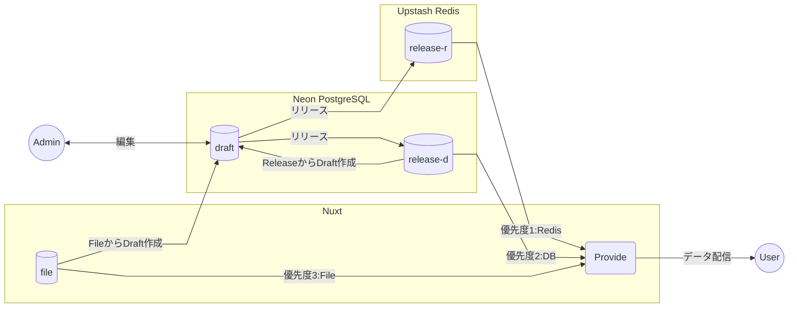
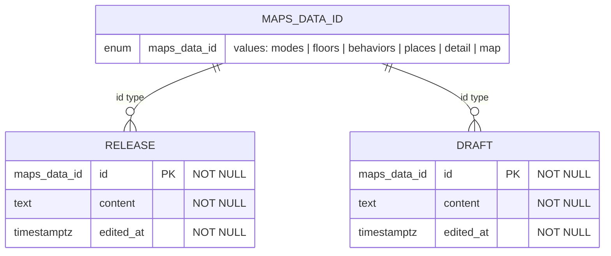

# バックエンドの仕様

## オンライン簡易編集機能

- あくまでも簡易的な編集を提供する
  - 高度なものはSVGエディタの実装が必要になるため、対象外
- バージョン管理は行わない
- 編集中の"draft"と公開中の"release"の2種類のデータを管理する

## 構成

### データフロー図

### データ構成

- オンラインではバージョン管理を行わず、編集可能な`draft`と、公開用の`release`の2種類のデータのみを管理する
- `file`は、静的ファイルとして[web/server/assets](web/server/assets)に保存されているデータで、オンライン編集は不可

#### データのオンライン編集

- 管理者は`draft`データのみを編集可能
- `draft`データは、`release`か`file`から作成できる

#### データの提供

- 各サービスの無料枠を考慮し、以下の優先順位でデータを提供する
  1. Upstash Redis (`release-r`)
  2. Neon PostgreSQL (`release-d`)
  3. ファイルシステム (`file`)
- `release-r`と`release-d`は常に同期され、最新のデータを提供する
- `file`はオンライン編集が不可であるため、最終手段としてのみ使用する

## データベース ER図

## Upstash Redis の自動停止対策

Upstash Redis は、無料プランの場合、一定期間アクセスがないと自動的に停止されます。
これを防ぐため、毎週月曜日の午前3時にRedisへアクセスするCronジョブを設定しています。

Vercelでホストをする場合は、[vercel.json](web/vercel.json)の設定に基づき、`/api/cron/redis-ping`エンドポイントにリクエストを送信して、pingを行います。

それ以外の場合は、[nuxt.config.ts](web/nuxt.config.ts)の設定に基づき、Nitroのスケジュールタスク機能を使用して、`redis-ping`タスクを実行します。

## 開発サーバーでのキャッシュ

開発サーバーでは、キャッシュなどの都合で、未ログイン状態で`/admin`配下へアクセスができてしまう場合があります。
現状、本番環境では発生を確認していません。
