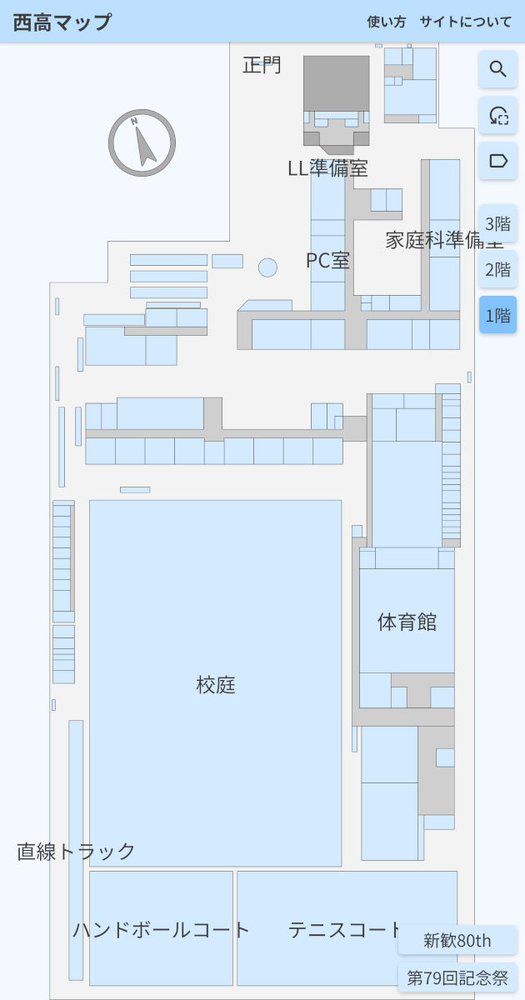
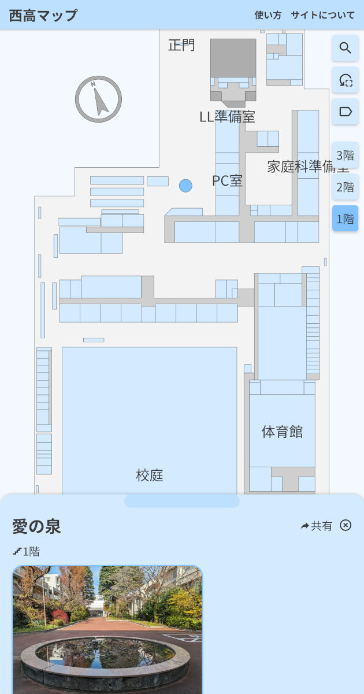
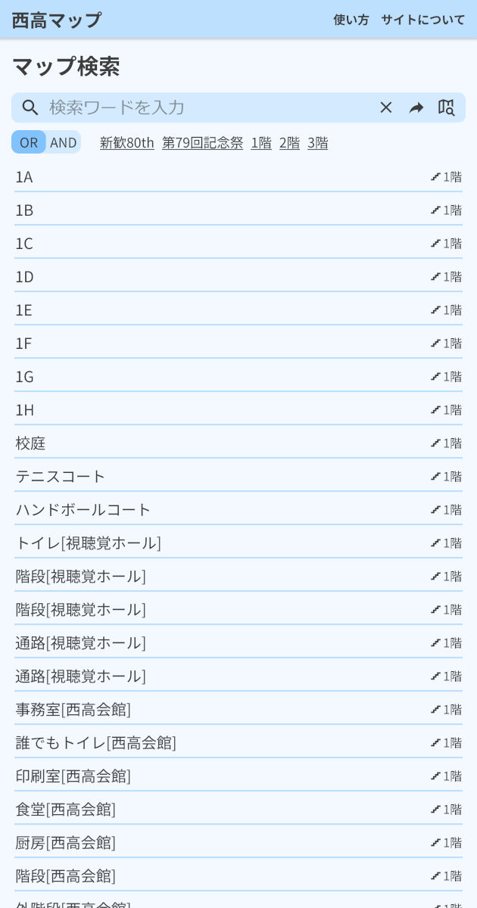
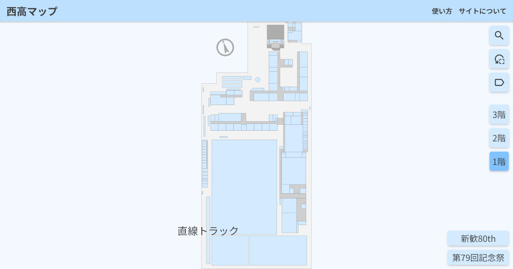
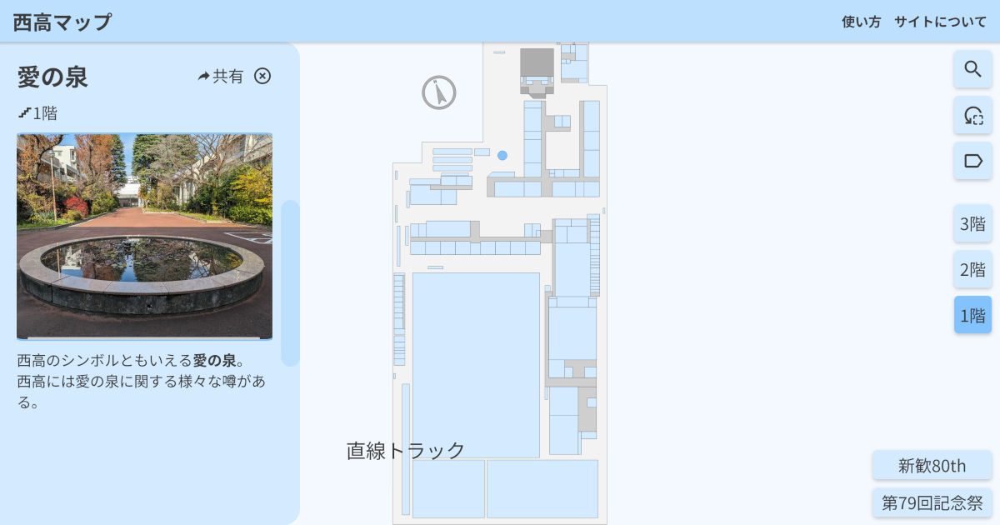
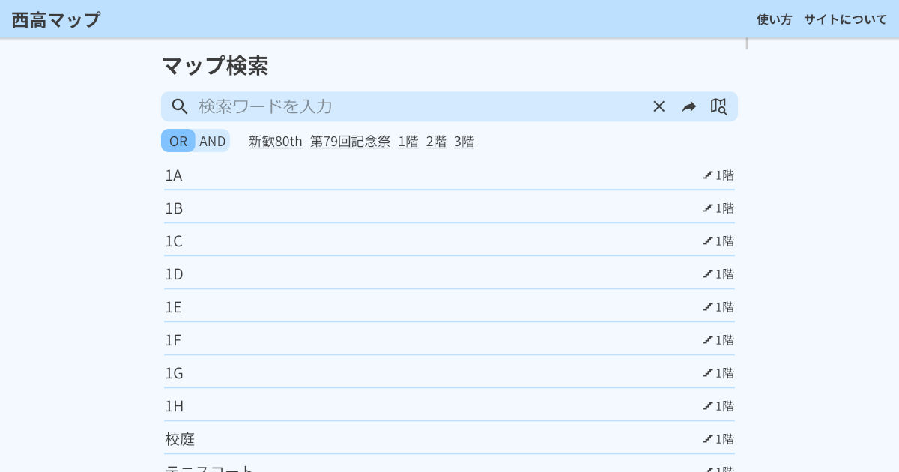

# SchoolMaps | 西高マップ

## 概要

[東京都立西高等学校](https://www.metro.ed.jp/nishi-h/)の校内マップアプリです。

## リンク

- [西高マップ(https://maps.nishi-h.net/)](https://maps.nishi-h.net/)
- [PV映像(https://youtu.be/o8RLhzpfBVg)](https://youtu.be/o8RLhzpfBVg)
- [ミラーサイト(https://school-maps.vercel.app/)](https://school-maps.vercel.app/)

## ライセンス

### プログラム

本リポジトリのプログラムは[MITライセンス](./LICENSE)の下で提供されます。

### マップデータ

[mapsディレクトリ](./maps/)内を始めとする、プログラムを除くマップデータについては、都立西高等学校の生徒に限り、自由にご利用いただけます。
それ以外の方によるサイトの閲覧を制限するものではありませんが、マップデータをサイト外で利用することはご遠慮ください。

## 詳細

### ディレクトリ構成

| ディレクトリ | 説明 |
|------------|------|
| web        | Nuxt4を使用したWebアプリケーションのソースコード |
| maps       | マップ及び関連データ |
| tools      | マップ作成・編集用のツール |
| icons      | アイコン画像 |

### ドキュメント

- [マップデータの構造と作成方法](./MapData.md)
- [SchoolMaps Tools(マップ作成・編集ツール)](./tools/README.md)
- [バックエンドの仕様](./Backend.md)

### スクリーンショット

| モバイル - マップ | モバイル - 詳細 | モバイル - 検索 |
|:--:|:--:|:--:|
|  |  |  |

| パソコン - マップ | パソコン - 詳細 | パソコン - 検索 |
|:--:|:--:|:--:|
|  |  |  |
